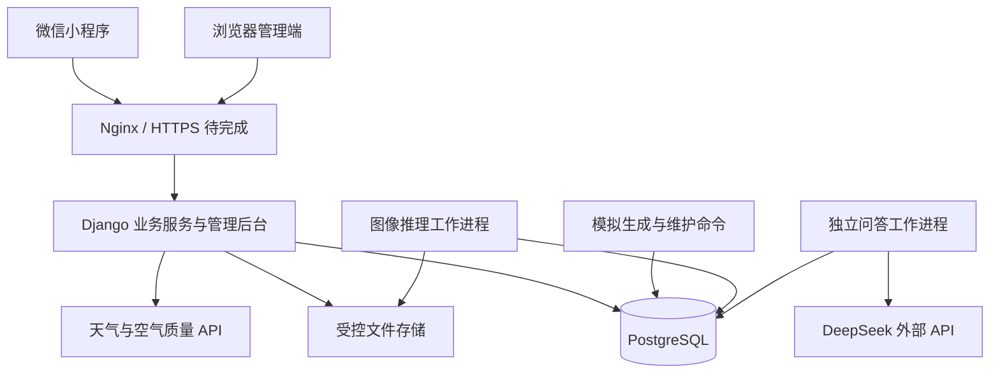

# HYHQ 海晏河清智慧平台开发方案稿

> 云分支补充（2026-10-03）：本副本已平行实现云调用、分块私有文件与容器运行适配，原自建版本保留。下方 9 月 30 日“不迁云”是自建版历史安排；本分支以 [云迁移计划](云迁移实施计划.md) 和 [本地验证记录](verification/云迁移本地验证记录.md) 为准。云版管理后台入口关闭，外部提供方默认关闭，真实云端仍待部署验收。

版本：v0.3（M5 基线与自建部署方向）

初稿日期：2026-09-16；状态更新：2026-09-30

核对基线：已推送 M5 源码快照 `6901985`；北京最近有记录的业务部署为 `d4d0bed`。M1/M2 业务、五类花卉与河道观察、三板块 DeepSeek、和风天气、管理统计审计与模拟维护已有实现；M5 新增有来源的资料检索、天气上下文、评论/预报/提醒和授权音频代码，后三类增强按条件关闭或隐藏。M5 的 9 月 24 日本机验证见 [验证记录](verification/M5本地增强验证记录.md)，不代表服务器已同步。河湖与数据中心历史观测仍主要使用模拟数据，公网、真实微信登录、完整手机流程及正式负载待验。

2026-09-30 已确定**不迁移微信云开发**，沿用北京服务器、Django、PostgreSQL 和现有工作进程；下一阶段按 [S01–S09 自建服务器开发计划](自建服务器后续开发计划.md) 推进。本日只修订规划，没有重新核实服务存活、平台权限或域名状态。

使用说明：[最新版功能介绍与使用说明](最新版功能介绍与使用说明.md)。当前任务与验收状态：[开发目标 TODO](开发目标TODO.md)。本文说明方案和功能边界；后文的完成条件、建议性能目标及后续增强不表示已经验收。

河道增量的具体范围、来源和限制见 [朋友仓库整合说明](朋友仓库整合说明.md)：独立漂浮物实验检测、可选水体关联和私有观察记录；教学规则分不作为官方水质或生态指数。

## 1. 项目定位与目标

HYHQ 海晏河清智慧平台是一款面向校园及周边河湖、公园场景的生态信息与绿色生活微信小程序。平台整合天气与空气质量服务、可追溯的河湖模拟数据、静态生态导览、轻量图像识别和管理员发布的科普内容，提供环境信息查看、生态学习、绿色游览及个人记录功能。

项目用于课程、毕业设计或比赛演示，以个人主体开发。生态点位采用明确标注的虚构示范区域；真实天气独立覆盖天津市、天津工业大学、天津师范大学、天津理工大学、北京市。采用模块化后端，已接入 DeepSeek 外部问答，并为真实监测数据和地图服务保留扩展空间。

### 1.1 核心使用流程

手动选择天气地点 → 浏览生态导览 → 进入地点或河湖详情 → 查看指标趋势 → 上传五类花卉或河道照片 → 查看结果并按需使用 AI 解读 → 阅读关联科普 → 收藏或记录游览 → 在个人中心找回记录。导览和科普也可从浮动 AI 入口围绕当前资料提问。

管理员能够维护地点和内容、查看数据来源、配置识别模型、处理反馈、查询统计与审计，并预览和确认模拟批次维护；模拟生成和导入另有管理命令。

### 1.2 开发目标

1. 形成用户端、服务端、管理端、数据库和图像推理之间可验证的完整流程。
2. 明确区分实时服务数据、历史公开数据、模拟数据和管理员整理内容。
3. 在现有服务器上完成低并发演示，记录实际资源占用与响应时间。
4. 支持更换数据源、模型和文件存储方式，避免页面依赖某个供应商的原始字段。
5. 交付源码、部署说明、数据与模型说明、验证报告和答辩演示材料。

## 2. 范围与版本划分

### 2.1 当前核心演示范围

| 模块 | 已实现范围与当前边界 |
| --- | --- |
| 首页 | 手动切换五个天气地点，真实天气、空气质量、气象预警、缓存状态；示范区说明与功能入口 |
| 生态导览 | 一张静态导览图、可点击点位、分类筛选、地点列表与详情 |
| 智慧河湖 | 水温、pH、浊度、溶解氧模拟数据，历史曲线、统计及质量/缺测状态 |
| 数据中心 | 指标卡、历史趋势、时间范围选择、来源筛选；与河湖页共用查询服务 |
| AI 识别 | 五类花卉候选、低图质无法确认、关联科普与私有记录；未知类别可靠拒识待补 |
| 河道观察 | 漂浮物实验检测框、版本化教学规则分、可选水体关联及私有记录 |
| AI 问答 | DeepSeek 识别解读、生态导览、科普智游三板块；资料上下文、Markdown、独立日额度及历史 |
| 科普智游 | 管理员文章、预设游览路线、地点关联、收藏和游览记录 |
| 我的 | 登录流程、主动设置昵称头像、收藏与个人记录、反馈、隐私设置、注销；本机使用开发登录，正式微信登录待配置验收 |
| 管理端 | 用户与权限、内容、地点、监测站、指标、模型、LLM/天气配置与用量、统一统计、关键操作审计及模拟维护 |

默认植物识别作为首个任务。M3 首个原型收敛为公开 flower_photos 的五类花卉：雏菊类、蒲公英类、蔷薇属花卉、向日葵类、郁金香类。这些是数据集标签，不是严格的物种或园艺品种鉴定；校园实拍及范围外图片的评估仍待补充。原先建议的 10～20 种校园植物作为后续扩充目标，不能从五类公开数据集成绩推定已实现。

### 2.2 后续增强与待启用能力

- 垃圾物品识别及当地分类规则映射。
- 确定性资料检索、引用和用户选定地点的缓存天气上下文已完成；真实长答、多轮质量、手机显示及金额账单待扩大验收。语义检索、多文档生成、联网搜索和主动天气工具未实现。
- 本地 Qwen3.5-2B 量化实验；通过测试后按开关启用。
- 更多历史公开数据、真实监测数据接口和实际地图服务。
- 基于定位的到访验证尚未实现；评论与举报代码已完成，主体能力、安全核验与审核人员未确认，继续关闭。
- 三日预报和单次订阅代码已完成，账号权益及真实送达待核实；授权音频代码已完成，正式素材和手机兼容性待补。

首版采用预设路线与用户自记游览记录，不承诺导航、路线优化或真实到访核验。以上增强不替代当前公网、真机和稳定性验收的收尾工作；热带气旋、海洋和辐照接口按用户要求排除，不列为后续待接入内容。

### 2.3 功能边界

- 河湖数据为模拟时，所有相关页面、导出及统计均标明模拟来源。
- 暂缓综合生态指数。以后增加时必须说明公式、权重、缺失处理和版本，采用“平台演示评分”等明确名称。
- 当前四项河湖指标用于展示和教学，不输出完整官方水质类别。
- 数据中心采用图表页面，不部署完整 Superset。
- 模型训练在开发电脑或其他算力环境执行，演示服务器负责推理。

## 3. 页面结构与角色

### 3.1 用户端五个一级入口

| 入口 | 子页面与能力 |
| --- | --- |
| 首页 | 天气地点选择、天气和预警、示范区概况、智慧河湖/数据中心/河道观察入口 |
| 生态导览 | 图片导览、地点列表、地点详情、河湖详情、场景 AI |
| AI 识别 | 图片选择、上传与处理状态、花卉结果、关联科普、河道观察与 AI 解读入口 |
| 科普智游 | 文章列表与详情、植物知识、绿色生活、预设路线、场景 AI |
| 我的 | 资料、收藏、浏览/花卉/河道/游览/AI 对话记录、反馈、隐私、协议、注销 |

用户选择的天气地点与示范区域分别显示。大学入口展示附近区域天气，不代表校园传感器测量；切换天气城市不得自动将示范区河湖数据描述为当地数据。首页尚未按定位自动切换城市。

### 3.2 角色与权限

- 游客：浏览公开地点、科普和环境数据。
- 登录用户：使用需要保存结果或消耗推理资源的功能，管理自己的资料、收藏和记录。
- 内容管理员：维护被授权的内容与地点。
- 系统管理员：管理角色权限、数据源、模拟场景、模型、服务开关和运行日志。

管理员权限与记录归属均由服务端校验。用户不能通过修改请求中的用户 ID 访问他人的识别图片或记录。

### 3.3 管理端范围

采用 Django Admin，并为统计、模拟维护与识别任务添加必要页面。模型管理提供版本登记、类别清单、阈值、启停和回退，未建设在线训练平台。已实现问题反馈和管理员回复；公开评论、举报和审核已有代码，满足实际开放条件前保持关闭。

管理统计按北京时间日边界统一查询，区分当前存量与时间窗口内新增量并按管理权限裁剪。关键管理变更有只读审计记录。模拟维护按保留策略生成清理预览、确认后重新检查并执行，保护真实观测和需保留的批次；没有启用模拟批次定时自动删除。

## 4. 技术架构与部署

| 层次 | 开发基线 |
| --- | --- |
| 小程序 | 原生微信小程序 JavaScript/WXML/WXSS，自定义 canvas 趋势组件与明细表 |
| 业务服务 | Django + Django REST Framework，按业务域划分模块 |
| 管理端 | Django Admin + 必要的自定义统计页面 |
| 数据库 | PostgreSQL |
| 图片识别 | 独立花卉/河道工作进程，ONNX Runtime CPU 推理；两类任务共享推理执行锁 |
| 定时任务 | Django 管理命令 + systemd timer；已启用私有数据清理，模拟批次维护按预览确认执行 |
| 接入与进程管理 | Nginx 反向代理、systemd 服务；正式 HTTPS 尚待域名接入条件完成 |
| 文件存储 | 首版受控本地目录，通过存储接口访问；后续可切换对象存储 |
| LLM | 独立问答工作进程，通过后端网关调用 DeepSeek；本地 LLM 未部署 |

开发启动时锁定互相兼容的 Python、框架与推理依赖版本，通过虚拟环境隔离运行，不随系统 Python 自动升级。前端构建和模型转换在开发环境完成。

### 4.1 小规格服务器运行策略

- 实际北京服务器为 Debian 13、2 核、约 2GB 内存；早期首尔 4GB 规划不作为当前资源实测基线。
- 业务 Web 进程不重复加载图像模型；识别请求创建任务，由花卉或河道工作进程处理，共享执行锁控制图像推理并发。
- 识别并发初始设为 1，配置排队上限、执行超时和线程上限，具体值通过实测确定。
- 和风结果按地区持久缓存、访问时按需刷新，未开启定时全量预热；全局持久账本控制上游调用。
- 历史数据查询限制时间范围与返回点数，长时间跨度使用小时或日聚合。
- 数据库和推理服务只开放内部访问；公开端口按实际需要配置。
- 已配置服务管理、私有图片清理并保存部署备份；定期自动备份、完整恢复演练、长期告警和整机重启验收继续保留待办。
- DeepSeek 外部服务已启用；本地 LLM 尚未部署，需先验证当前小规格机器的时延与内存再决定是否实施。

### 4.2 微信访问前置验证

服务器环境、数据库、应用依赖与既有基线内部业务已有部署验证。9 月 23 日公网记录为腾讯云域名拦截、未完成 HTTPS，真实微信登录缺 AppSecret；实际部署前需重新核实这些条件。域名备案接入、HTTPS、微信合法域名、小程序账号能力与手机上的定位权限仍需完成对应验证。环境示例的默认关闭不代表服务器 DeepSeek/和风仍关闭。

上线验收需用实际账号和手机验证登录、接口请求、上传、下载及权限拒绝情况。开发工具中关闭域名校验的成功结果不能视为目标演示路径通过。若目标路径不可用，应明确调整域名接入或部署方案；公开发布另行确认对应要求。

## 5. 数据方案与领域模型

### 5.1 数据来源

| 数据 | 接入方式 | 必须记录的说明 |
| --- | --- | --- |
| 天气、湿度、预警 | 已接入和风天气，按五个指定地点按需读取并缓存 | 地点、来源、观测/发布时间、有效期、获取状态 |
| 空气质量 | 已接入和风 AQI 与污染物字段 | AQI 标准、污染物代码、单位、空间覆盖及缺失字段 |
| 河湖指标 | 管理命令按采样间隔生成并入库的模拟序列；真实来源待接 | 场景、参数、种子、运行批次、生成器版本 |
| 历史数据 | 有明确使用许可的数据集导入 | 原始地点、观测时间、导入时间、原始出处和许可 |
| 地点、文章、路线 | 管理员整理 | 图片与文字来源、更新时间、发布状态 |
| 识别数据集 | 公开许可数据与允许使用的自采图片 | 类别、版本、许可、划分方式与去重说明 |

不预设 VOC 等字段一定可用；缺失数据保留为空值。预警接口请求失败不能显示成“当前无预警”，旧预警不得当作正在生效的信息继续展示。

和风预算固定为本机每月 100 次、北京每月 29,900 次，合计不超过 30,000 次；天气、空气、预警分别计次，失败与超时也计入，并有滚动 31 天附加限制。密钥只保存在受保护且被 Git 忽略的环境配置；不能复制新账本或恢复旧账本后继续外呼。此上限覆盖项目自身调用，项目外使用同一凭据的请求无法由本项目控制。当前没有将天气缓存积累为完整历史观测序列。

### 5.2 核心实体

| 实体组 | 主要职责 |
| --- | --- |
| 用户、会话、角色 | 登录身份、资料、令牌失效、权限 |
| 区域、地点、水体、监测站 | 校园/城市范围、导览点位及河湖和监测关系 |
| 底图、点位布局 | 底图版本、相对坐标、关联地点 |
| 指标定义、数据源、观测记录 | 指标代码与单位、来源、观测值与质量状态 |
| 模拟场景、模拟运行 | 场景参数、种子、批次、重放与版本 |
| 内容、路线、路线节点 | 科普文章、地点/植物关联、预设游览顺序 |
| 模型版本、类别映射、识别任务 | 模型制品、输入约定、任务状态、结果及耗时 |
| 收藏、浏览记录、游览记录、反馈 | 用户行为与问题处理 |
| 操作日志、任务日志 | 管理变更、数据处理、失败原因与耗时 |
| 天气地点、缓存、请求账本 | 真实天气读取、缓存有效性与外部调用预算 |
| 问答会话、回合、额度与调用账本 | 场景上下文、异步问答、用户额度与全站成本控制 |

一条河湖可关联多个监测站，一个监测站可包含多种指标。图上地点与监测站不强制一一对应。

### 5.3 观测数据契约

统一字段包括：`station_id`、`metric_code`、`value`、`unit`、`observed_at`、`ingested_at`、`source_id`、`source_type`、`quality_status`，模拟数据增加 `simulation_run_id`。

- `source_type` 固定为 `api / dataset / simulation / manual`；页面模拟标记根据来源生成。
- 观测时间与导入时间分别保存；服务端统一时间存储，展示时转换为明确时区。
- 缺失值为 `null`，并记录质量状态；不能以 0 填充缺失观测。
- 导入与生成制定去重键，重复执行不会产生同一批次的重复观测。
- 查询、聚合、导出均显式限定来源；不将真实值与模拟值合并为一个未说明的指标。
- 第一版对来源有明确标识；真实接口失败时显示过期缓存或暂不可用。手动进入演示模式后才可使用模拟替代，并明显标记。

### 5.4 模拟生成规则

以基准值、日周期、小幅噪声和上下限生成连续数据，按固定采样间隔入库，页面刷新只查询。至少支持正常波动、突发浑浊、数据缺失三类场景；固定种子和版本后可以重放。

阈值提示关联具体指标和规则版本，明确标为模拟场景提示，与官方气象预警分开。场景只用于验证系统行为，不声称能够准确模拟自然环境的因果关系。

### 5.5 静态导览

点位保存 `map_id`、`place_id`、`x_ratio`、`y_ratio`，位置相对底图内容区域计算，缩放时同步变换。可选保存经纬度与坐标系，用于后续地图接入。底图与点位布局绑定版本，避免替换图片后点位错位。

## 6. AI 识别与问答方案

### 6.1 首个识别任务

首轮已比较 MobileNetV3-Small 与 EfficientNet-B0，当前使用后者的 ONNX 模型：使用 ImageNet 预训练主干提取冻结特征，在统一的去重分组划分上训练分类头，以验证集选择模型和阈值。独立测试集只用于最终报告。花卉分类限定照片中一个主要花卉主体；多目标花卉检测未实现。另一个河道观察模块已运行漂浮物实验检测，不能据此宣称花卉或垃圾已支持多目标检测。

训练数据来自 TensorFlow 官方 flower_photos 归档，逐图作者、原链接和 CC-BY 许可随清单保留。原始照片、特征缓存和模型权重不进入源码仓库。公开数据集分数用于评估五类范围内的原型，不代表校园照片、其他植物或垃圾识别效果。高分也可能是范围外图片的误判，阈值不能保证拒绝所有未知对象。

流程：登录用户上传图片 → 服务端校验并创建任务 → 工作进程预处理与推理 → 保存模型版本、候选结果与分数 → 返回识别状态及关联科普。

- 任务状态统一为 `queued / running / succeeded / failed`，失败包含稳定的错误代码。
- 业务结果支持候选参考和无法确认；分数低于所用阈值时不输出确定结论。当前 v1 的预设验证规则得到阈值 0，尚未启用低分拒识；低图质返回无法确认。范围外类别的可靠拒识仍需独立数据验证，不能仅靠五类 softmax 分数保证。
- 模型登记包含权重来源、许可、类别映射、预处理步骤、阈值和制品校验值。
- 分数用于排序和阈值判断，未经校准不表述为实际正确概率。
- 数据集先去重，再划分训练、验证和测试集；阈值根据验证集确定。
- 已保存五类公开数据独立测试集结果；校园实拍和范围外样本仍需补充，并记录准确率、宏平均 F1、混淆矩阵、推理延迟、峰值内存及失败例子。

### 6.2 已实现的 DeepSeek 网关与后续范围

当前固定使用 DeepSeek `deepseek-flash`，提供环境密钥读取、超时、上下文和输出长度、用户额度、全局预算、并发与开关配置；并非可任意切换供应商的多模型网关。

识别、导览、科普三个板块各有系统提示，服务端根据来源 ID 读取当前已发布资料和必要关联内容；提示前缀不预填到用户输入框。回复支持受限 Markdown、私有历史与删除。每个账号每个板块每天最多 5 个成功回合，平时不显示次数，超过时才拦截提示；业务页已移除重复协议勾选，注册/登录及“我的”保留统一协议入口。识别解读可由用户主动选择附上有效原图，默认不附图。

外部 API 必须同时满足启用状态、可用凭据和预算条件；用户主动发送后才调用，不因打开页面自动外发。当前已有已发布资料的确定性检索、来源引用和只读天气缓存上下文，没有语义检索、主动天气工具或联网搜索；真实多轮质量、长回答体验和金额账单仍需进一步验收。

本地 Qwen3.5-2B 尚未安装和测试。如后续实施，需验证兼容量化、纯文本短上下文单请求，记录模型与运行时版本、首字延迟、完整响应时间和整机峰值内存，再决定是否在当前服务器启用。

问答不能把模拟数据描述成实测结果；模型调用只传所需资料，不附带 OpenID、无关用户资料或原始位置轨迹。

## 7. API 与扩展约定

API 统一使用 `/api/v1/` 前缀，当前主要资源如下；参数与完整路由以各模块 `urls.py` 及接口文档为准：

| 资源 | 职责 |
| --- | --- |
| `/auth/wechat/`、`/me/` | 登录换取业务会话、当前用户及账号生命周期 |
| `/regions/`、`/places/`、`/maps/` | 区域、地点、底图及点位 |
| `/weather-data/locations/`、`/weather-data/summary/` | 五个真实天气地点及天气/空气/预警摘要 |
| `/weather/`、`/air-quality/`、`/weather-alerts/` | 既有示范环境摘要接口，与真实天气入口区分 |
| `/stations/`、`/observations/`、`/observation-series/`、`/simulation-runs/`、`/dashboard/` | 监测站、观测、受限时间序列、批次与聚合 |
| `/contents/`、`/routes/` | 内容与预设路线 |
| `/recognition-jobs/` | 花卉上传任务、进度和结果 |
| `/assessment-jobs/`、`/water-bodies/`、`/nearby-water-bodies/` | 河道观察与可选水体关联 |
| `/favorites/`、`/histories/`、`/visits/`、`/feedback/` | 用户记录与反馈 |
| `/llm/status/`、`/llm/sessions/`、`/llm/turns/<id>/` | 问答状态、会话与回合；提交回合使用会话下的 `turns/` 路由 |

错误格式、鉴权、分页、时间格式和来源元数据保持一致。数据采集、模型推理和文件存储通过明确的内部接口替换实现，不提前引入复杂插件系统。

## 8. 隐私、文件与运维

- 微信登录只用于建立身份，昵称头像由用户主动设置。微信 AppSecret、上游 API 密钥只保存在服务端，日志脱敏。
- 定位按功能需要触发；拒绝授权仍可手动选地区并浏览内容，不持续采集位置。
- 图片限制文件类型、体积和解码尺寸，服务端实际解码校验、移除不必要元数据，使用随机存储名。
- 用户图片采用鉴权访问；识别记录与文件的删除、过期清理保持一致。
- 已落实默认保留策略：识别原图 24 小时，缩略图及识别记录 30 天，LLM 记录 30 天；收藏保留至用户删除或注销。实际清理由管理命令和服务器私有数据清理计时器执行，策略调整需同步隐私说明。
- 注销后立即使会话失效，删除或按明确规则处理用户关联记录和图片；备份中的保留及过期策略单独说明。
- 备份覆盖数据库与需要保留的内容资源，至少保有服务器之外的一份恢复材料，并在交付前完成一次恢复验证。

## 9. 交付与验收

### 9.1 核心版本完成条件

1. 目标账号和目标真机上能够完成核心流程；访问方式与任何限制有记录。
2. 管理员修改地点或发布文章后，用户端能看到更新。
3. 模拟数据可重放，来源、单位、时间和质量状态显示正确。
4. 一个真实图像模型完成推理，保留独立测试结果；不能用固定答案替代模型结果。
5. 收藏、记录、权限、删除、注销和失败处理可实际演示。
6. 在实际北京 2 核、约 2GB 环境下完成普通浏览与识别同时运行的测试，报告实际值；早期 4GB 规划不代替当前硬件验收。
7. 部署重启后能恢复服务，数据库与资源可从备份恢复。
8. 提供源码、配置示例、部署指南、数据清单、模型评估报告和演示脚本。

### 9.2 建议测试口径

以下保留初始验收目标，不代表已测性能；调整时必须记录原因。现已有内部回归、短时负载与服务重启记录，未完成下面的 30 分钟联合负载和整机重启验收。

- 5 个并发浏览用户并同时提交 1 个识别任务，持续运行 30 分钟，无进程崩溃或内存不足终止。
- 缓存命中的普通读取 API，服务端响应 p95 不超过 1 秒；真机端到端耗时单独记录。
- 单张图片在任务开始执行后 10 秒内给出结果或明确失败；上传耗时、排队时间分别记录。
- 演示全过程页面均能呈现加载、空数据、错误和重试状态。
- 服务重启后的在途识别任务能够恢复或进入明确失败状态，不永久停在处理中。
- AI 准确率目标在类别与数据集冻结后、查看最终测试结果前确定。

## 10. 决策与剩余事项（2026-09-21）

| 项目 | 当前状态 | 决策节点 |
| --- | --- | --- |
| 示范校园、城市与点位 | 真实天气五地点已确定；生态点位仍为虚构示范，真实校园地点与地图待接 | 真实地图接入前核对点位及坐标 |
| 账号能力、域名和演示访问方式 | 内部部署已验证；域名拦截、HTTPS、微信 AppSecret/合法域名与真机仍待完成 | M0/正式上线验收 |
| 天气与空气质量服务商 | 和风已接入，五地点本机和北京均真实联通；项目每月合计上限 30,000 次 | 已完成首批接入；新增地点前重算预算 |
| 植物类别与训练数据 | 五类 flower_photos 已冻结，校园实拍/未知对象待补 | M3 公开数据实验已完成，后续另行验证实际场景 |
| 图片与记录保留期限 | 已落实默认保留策略与私有数据清理；定期备份及备份中的保留需继续完善 | M1 已实现，M4 运维补验 |
| 演示规模与性能目标 | 当前实际机器为 2 核约 2GB；正式 30 分钟负载与整机重启尚未验收 | M4 实测 |
| 外部 API 凭据与预算 | DeepSeek、和风已在本机与北京环境变量配置并真实联通；真实密钥不入 Git | 保留持久账本；长时资源与提供方账单仍需核对 |
| 管理统计、审计与模拟维护 | 已完成并通过 48 项管理实际流程；批次维护为预览后确认执行 | 后续按需要评估自动维护与管理界面优化 |

最新整体验证：377 项后端测试、257 项小程序测试及 48 项管理流程检查通过；北京真实天气和 DeepSeek 联通成功。详见 [真实天气与管理验证记录](verification/真实天气与管理验证记录.md)。这些证据不替代完整手机、公网与长期稳定性验收。

## 11. 参考资料

以下资料用于说明方案依据；账号实际能力和接入条件以开发时验证为准。

- 小程序接口域名与 HTTPS 接入：[阿里云小程序后端部署说明](https://help.aliyun.com/zh/ecs/user-guide/develop-your-wechat-mini-program-in-10-minutes)。
- 小程序备案与公开服务条件：[工信部 APP 备案通知](https://www.miit.gov.cn/zwgk/zcwj/wjfb/tz/art/2023/art_920db564162e4312916a01bed6540ad8.html)。
- 初稿图表选型参考：[ECharts 微信小程序组件](https://github.com/ecomfe/echarts-for-weixin)；当前实际使用自定义 canvas 趋势组件，未引入 ECharts。部署取舍参考 [Superset FAQ](https://superset.apache.org/user-docs/faq/)。
- 内部管理后台采用现有能力：[Django Admin 文档](https://docs.djangoproject.com/en/5.2/ref/contrib/admin/)。
- 图像推理限制线程：[ONNX Runtime 线程管理](https://onnxruntime.ai/docs/performance/tune-performance/threading.html)。
- 本地模型需量化实测：[Qwen3.5-2B 官方权重与说明](https://huggingface.co/Qwen/Qwen3.5-2B/tree/main)。
- 已接入的和风天气服务参考：[空气质量接口](https://dev.qweather.com/en/docs/api/air-quality/air-current/)、[气象预警接口](https://dev.qweather.com/docs/api/warning/)。
- 河湖指标展示与完整评价的边界：[地表水环境质量标准](https://www.mee.gov.cn/ywgz/fgbz/bz/bzwb/shjbh/shjzlbz/200206/t20020601_66497.shtml)。
